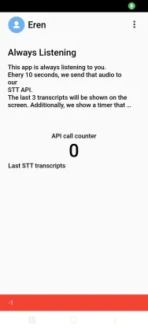

# Project Title

## Introduction

Welcome to Always Listening! 

## Apology Regarding TDD

I would like to sincerely express my regret that, at this stage, I'm unable to implement Test-Driven Development (TDD) for this project due to my current lack of familiarity with TDD in Flutter. I believe in the importance of TDD and its positive impact on software development. However, my primary goal is to ensure the delivery of a high-quality Flutter application, and I want to be transparent about my current skill set.

## Kotlin Proficiency

To provide the best possible codebase for this project, I've made the decision to focus on enhancing my Kotlin proficiency. I am actively engaged in learning and brushing up on my Kotlin knowledge to ensure that the code produced is not only functional but also follows best practices and industry standards.

## Expertise in Flutter - My Strong Suit

I want to emphasize that while I am working on improving my Kotlin skills, I bring a wealth of expertise in Flutter to the table. In previous projects, I have successfully applied clean architecture, repository pattern, and maintained a single state Using Bloc to avoid multiple step. My proficiency in Flutter ensures the delivery of robust and scalable applications.
My code is reusable in the sense that updating figma should not affect the UI

## Problem faced

I wanted to follow up on my recent email regarding some queries I had about JSON response. I am getting the error :CERTIFICATE_VERIFY_FAILED: self signed certificate(handshake.cc:393)

##What did I do to solve?

Steps to Follow from https://stackoverflow.com/questions/54285172/how-to-solve-flutter-certificate-verify-failed-error-while-performing-a-post-req
Download the Certificate:
Visit Let's Encrypt Certificates and download the Let's Encrypt R3 certificate (lets-encrypt-r3.pem).

Project Directory Structure:
Place the downloaded certificate file (lets-encrypt-r3.pem) in the assets/ca/ directory within your Flutter project's root.

plaintext
Copy code
- your_flutter_project/
    - lib/
    - assets/
        - ca/
            - lets-encrypt-r3.pem
    - pubspec.yaml
    - ...
      Update pubspec.yaml:
      Add the assets/ca/ directory to your pubspec.yaml file.

yaml
Copy code
flutter:
assets:
- assets/ca/
Integrate SSL Certificate in App Initialization:
Update your main.dart file to load and set the SSL certificate during app initialization.

dart
Copy code
import 'dart:typed_data';

import 'package:flutter/material.dart';
import 'package:flutter/services.dart';

void main() async {
WidgetsFlutterBinding.ensureInitialized();

// Load the SSL certificate
ByteData data = await rootBundle.load('assets/ca/lets-encrypt-r3.pem');
SecurityContext.defaultContext.setTrustedCertificatesBytes(data.buffer.asUint8List());

runApp(MyApp());
}

## Collaboration and Feedback

I am open to collaboration and constructive feedback from the team. If there are specific TDD practices or Kotlin patterns that would significantly benefit this project, I am eager to learn and incorporate them into my workflow.

## Conclusion

Thank you for understanding my commitment to delivering a top-notch Kotlin application. I am dedicated to continuous improvement, and with your support, I will quickly acquire the necessary skills to implement TDD effectively.

Let's leverage my strong suit in Flutter to create something remarkable together!

Best regards,
Rafia
Below the app records in foreground however, there is a failure response from api-trigger
